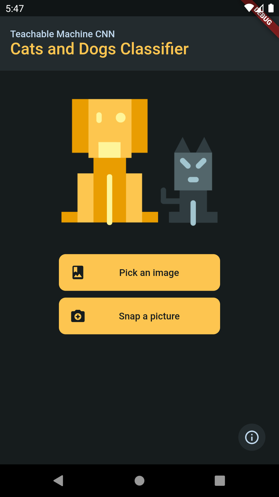
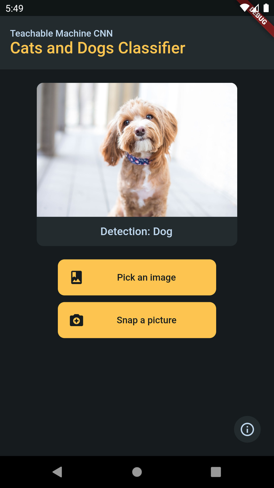

# Cats and Dogs Classifier

With the use of a Convolutional Neural Network (CNN), this app can intelligently classify the images you input into cats and dogs. The deep learning model is built using Google's [Teachable Machine](https://teachablemachine.withgoogle.com/).

The dataset used to build the model comes from [Kaggle](https://www.kaggle.com/tongpython/cat-and-dog), and it contains over 10,000 pictures of cats and dogs that were supplied as training input.

This app was created with the goal of learning the fundamentals of Android development from the ground up. It not include any advertisements and is completely free to try.

## Screenshots:

>Google Play and the Google Play logo are trademarks of Google LLC.
